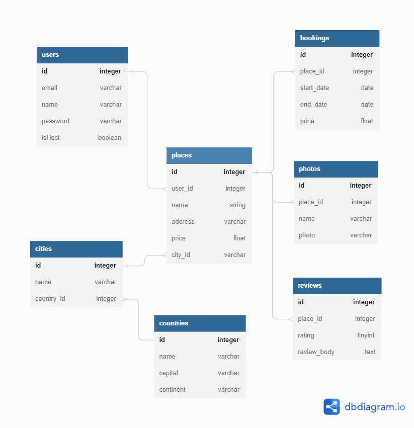

# api-node

A minimalist backend API to my books

# install

```
git clone https://github.com/danielschmitz/api-node.git
cd api-node
npm install
npm run createdb
npm run dev
```

API is litening at http://localhost:3000

Use the "Rest Client" VSCode Extension to make calls to API
https://marketplace.visualstudio.com/items?itemName=humao.rest-client

# database orm



# status code

| Status Code | Meaning | Description |
| --- | --- | --- |
| 200 | OK | Successful request |
| 201 | Created | Resource created successfully |
| 204 | No Content | Successful request but no content to return |
| 400 | Bad Request | Error in request |
| 401 | Unauthorized | Not authorized |
| 403 | Forbidden | Forbidden |
| 404 | Not Found | Not found |
| 500 | Internal Server Error | Internal server error |
| 503 | Service Unavailable | Service unavailable |