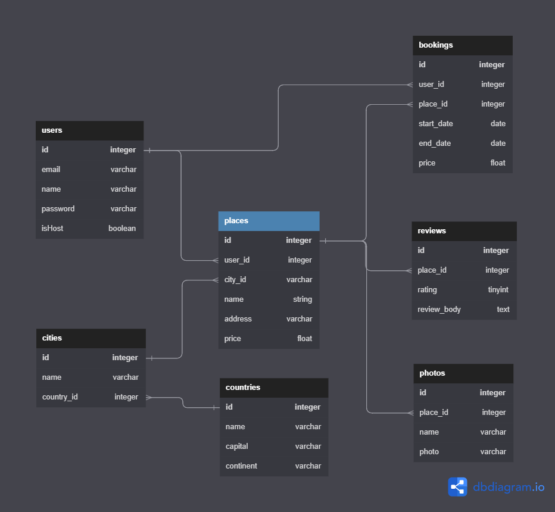

# api-node

A minimalist backend API to my books

# install

```
git clone https://github.com/danielschmitz/api-node.git
cd api-node
npm install
npm run createdb
npm run dev
```

API is litening at http://localhost:3000

Use the "Rest Client" VSCode Extension to make calls to API
https://marketplace.visualstudio.com/items?itemName=humao.rest-client

# database orm

